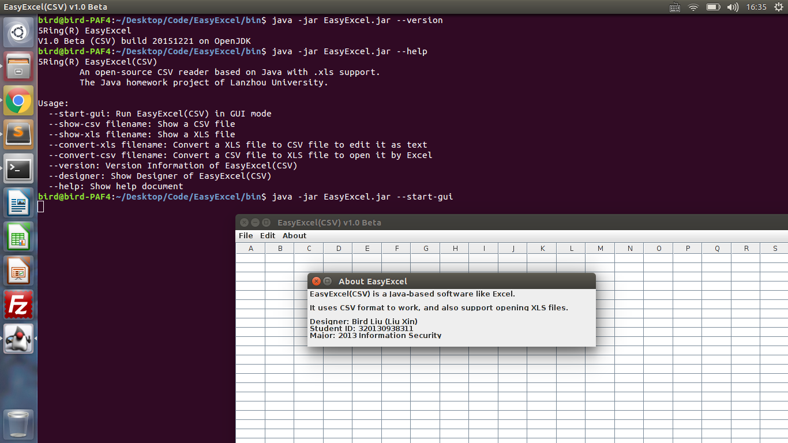

# 5Ring EasyExcel(CSV)

A Java-based CSV reader with .xls support for GUI & terminal environment.  

## Version

V1.0 Beta (CSV) build 20151221 on OpenJDK

## Author

[Bird Liu](https://github.com/dstsmallbird) <dstsmallbird@foxmail.com>

## Usage

1. Install Java Runtime Environment(JRE) 7 or later version.
2. Run the jar package in ./bin with --help know the usages(cmd: java -jar EasyExcel.jar --help)

LICENSE
-------
The GNU GPLv2 License.

NOTICE
-------
If you want to modify this project, please read the COPYRIGHT NOTICE at first.